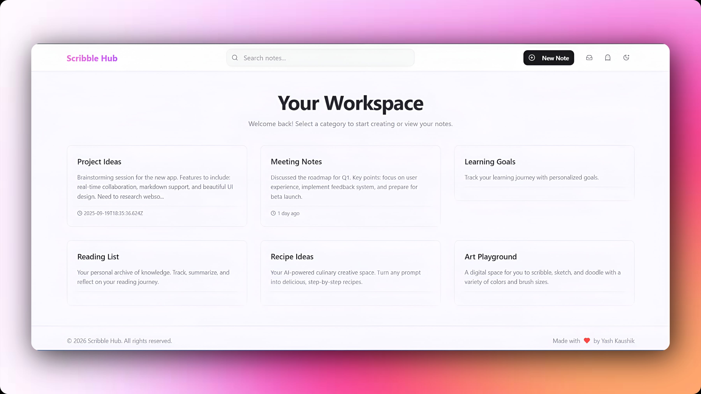

## 🚀 Features

### 🧠 Structured Workspace
- Centralized dashboard with categorized note sections  
- Pre-defined categories like:
  - Project Ideas  
  - Meeting Notes  
  - Learning Goals  
  - Reading List  
  - Recipe Ideas  
  - Art Playground  
- Designed for clarity, focus, and quick access  

---

### 📝 Note Management
- Create notes instantly using **“New Note”**  
- Each note includes:
  - Title  
  - Description preview  
  - Timestamp  
- Organized storage for easy retrieval and tracking  

---

### 🔍 Smart Search
- Global search bar to quickly find notes  
- Fast filtering across all categories  
- Eliminates the need to manually browse through notes  

---

### 🧩 Multi-Domain Productivity
- Supports different use-cases in one platform:
  - 📌 Idea tracking  
  - 📊 Meeting documentation  
  - 🎯 Goal setting  
  - 📚 Knowledge management  
  - 🍳 Creative/AI-assisted workflows  
  - 🎨 Freeform creative space  
- Goes beyond a simple notes app → acts as a productivity hub  

---

### 🎨 Clean & Minimal UI
- Card-based layout for better visualization  
- Distraction-free interface  
- Smooth typography and spacing for readability  
- Inspired by modern productivity tools  

---

### ⏱️ Activity Tracking
- Timestamped notes (e.g., “1 day ago”)  
- Helps users track recency and updates  

---

### 🔐 Personalized Experience
- User-specific workspace  
- Persistent notes across sessions  
- Welcome-based interface for better engagement  

---

## 🖼️ Preview

